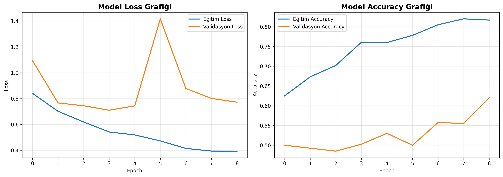
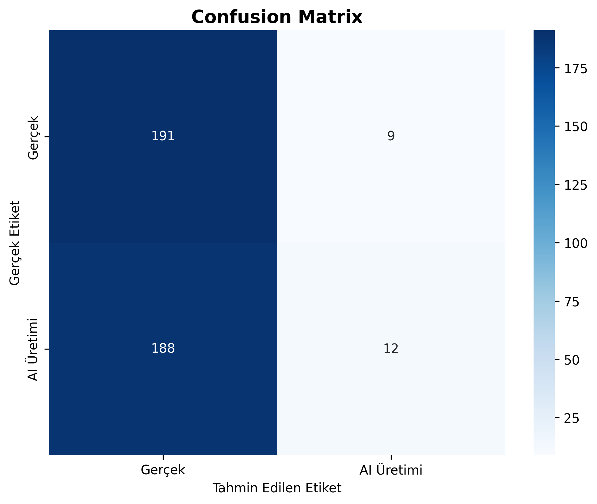
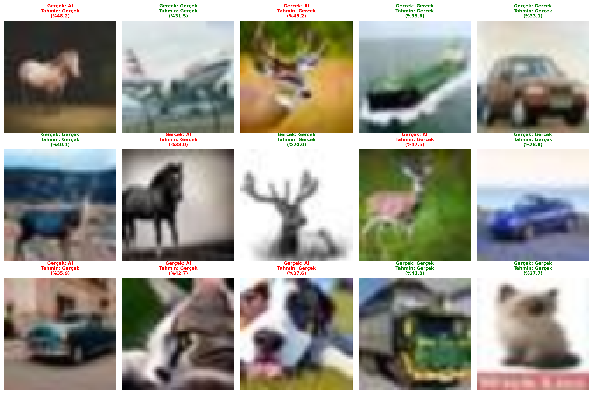

# AI Görsel Tespit Projesi 

Merhaba! Bu proje, bir görselin gerçek mi yoksa yapay zeka tarafından üretilmiş mi olduğunu tespit eden bir sinir ağı modeli.

## Proje Fikri

Günümüzde AI ile üretilmiş görseller her yerde karşımıza çıkıyor. ChatGPT, Midjourney, Stable Diffusion gibi araçlar muhteşem görseller üretebiliyor. Peki ya bunları gerçek görsellerden ayırt edebilseydik? İşte bu proje tam da bunu yapıyor!

##  Veri Seti

Kaggle'dan aldığımız **CIFAKE** veri setini kullandık:
- **60,000 gerçek görsel** (CIFAR-10 veri setinden)
- **60,000 AI üretimi görsel** (Stable Diffusion v1.4 ile oluşturulmuş)
- Her görsel 32x32 piksel boyutunda

🔗 [Veri Seti Linki](https://www.kaggle.com/datasets/birdy654/cifake-real-and-ai-generated-synthetic-images)

##  Model Mimarisi

Keras kullanarak CNN (Convolutional Neural Network) modeli oluşturduk. Model şöyle çalışıyor:

### Katmanlar:
1. **3 Convolutional Blok**
   - Her blok: 2x Conv2D + BatchNormalization + MaxPooling + Dropout
   - İlk blok: 32 filtre
   - İkinci blok: 64 filtre
   - Üçüncü blok: 128 filtre

2. **Dense Katmanlar**
   - 256 nöronlu tam bağlı katman
   - 128 nöronlu tam bağlı katman
   - Sigmoid çıkış (Binary Classification)

**Toplam Parametre:** ~2 Milyon

## 🚀 Kurulum

### 1. Gereksinimler

```bash
python --version  # Python 3.12+ olmalı
```

### 2. Kütüphaneleri Yükle

Basitçe setup.bat dosyasını çalıştırın:

```bash
setup.bat
```

Ya da manuel olarak:

```bash
pip install -r requirements.txt
```

### 3. Veri Setini İndir

- Kaggle'dan [CIFAKE veri setini](https://www.kaggle.com/datasets/birdy654/cifake-real-and-ai-generated-synthetic-images) indirin
- `cifake/` klasörüne çıkarın
- Yapı şöyle olmalı:
  ```
  cifake/
  ├── train/
  │   ├── REAL/
  │   └── FAKE/
  ```

##  Kullanım

### Eğitim ve Test

```bash
python ai_image_detection.py
```
veya

```bat
start.bat
```

Program size iki seçenek sunacak:
- **Demo Mod:** Hızlı test için (1000 görsel, 5 epoch, ~5-10 dk)
- **Tam Eğitim:** Yüksek performans için (10000 görsel, 20 epoch, ~30-60 dk)

Eğitim bittikten sonra, kendi görsellerinizi test edebilirsiniz!

### Örnek:

```
Test etmek istediğiniz görsel yolu: test_image.jpg

🔍 Görsel analiz ediliyor...

==================================================
SONUÇ
==================================================
✅ Bu görsel GERÇEK bir görsel
Güven Skoru: %94.23
==================================================
```

##  Eğitim Sonuçları

### Eğitim Grafikleri

Eğitim süreci boyunca loss ve accuracy değerlerinin nasıl değiştiğini görebilirsiniz:



*Loss ve accuracy grafikleri - Model ne kadar iyi öğreniyor görebiliyoruz*

### Confusion Matrix

Modelin tahminlerini gerçek etiketlerle karşılaştırdığımızda:



*Böyle bir sonuç aldık tabi ki bu demo ile alınmış bir sonuç tam eğitimde daha yüksek oranlar alınıyor*

### Örnek Tahminler



*Model test görsellerini analiz ederken - Yeşil başlıklar doğru tahminleri gösteriyor*

##  Proje Yapısı

```
neuralnetwork/
├── ai_image_detection.py       # Ana Python scripti
├── AI_Image_Detection.ipynb    # Jupyter Notebook versiyonu
├── requirements.txt            # Python kütüphaneleri
├── setup.bat                   # Otomatik kurulum scripti
├── README.md                   # Bu dosya
├── proje.md                    # Proje talimatları
├── cifake/                     # Veri seti (indirdikten sonra)
├── ai_image_detector.h5        # Eğitilmiş model (eğitim sonrası)
└── *.png                       # Görselleştirme çıktıları
```

## Teknik Detaylar

### Veri Ön İşleme
- Görseller 64x64'e yeniden boyutlandırıldı
- 0-255 arası piksel değerleri 0-1 arasına normalize edildi
- RGB formatına çevrildi

### Data Augmentation
Eğitim verisini çeşitlendirmek için:
- Döndürme (±15°)
- Yatay çevirme
- Zoom (±%10)
- Kaydırma (±%10)

### Optimizasyon
- **Optimizer:** Adam
- **Loss Function:** Binary Crossentropy
- **Batch Size:** 32
- **Early Stopping:** Val loss 5 epoch boyunca düzelmezse dur
- **Learning Rate Reduction:** Val loss 3 epoch boyunca düzelmezse LR'yi yarıya indir

### Ne Öğrendim:
- CNN mimarileri ile görsel sınıflandırma nasıl yapılır
- Data augmentation'ın önemi
- Batch normalization ve dropout ile overfitting'i önleme
- Keras callback'leri ile akıllı eğitim kontrolü

## Geliştiriciler

Bu proje Sinir Ağları dersi final projesi kapsamında geliştirilmiştir.
Muhammet İrfan Günel ve Fatma Nur Akın tarafından geliştirilmiştir

**Teslim Tarihi:** 07.01.2026

## Kaynaklar

- [CIFAKE Dataset](https://www.kaggle.com/datasets/birdy654/cifake-real-and-ai-generated-synthetic-images)
- [Keras Documentation](https://keras.io/)
- [CNN Architecture Guide](https://towardsdatascience.com/a-comprehensive-guide-to-convolutional-neural-networks-the-eli5-way-3bd2b1164a53)

---